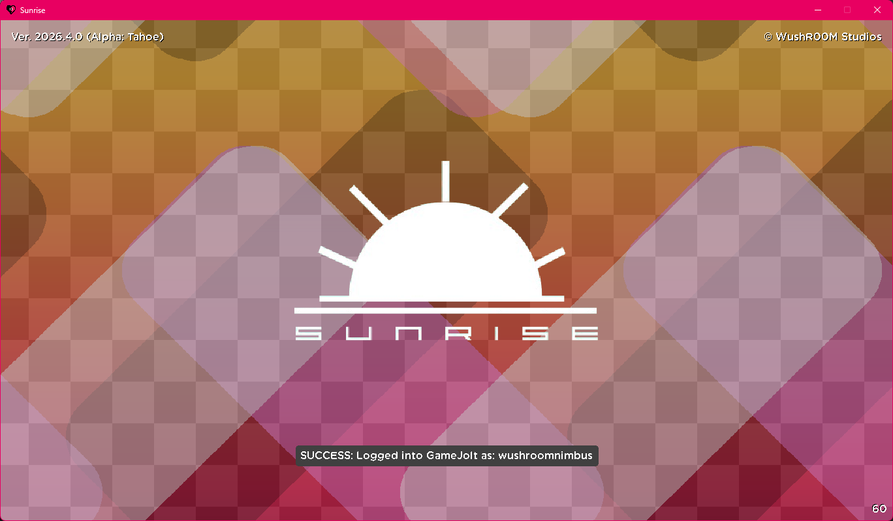

# Sunrise

If you're looking for a download link to the official compiled version, visit:
- [Official WushR00M Studios Page](https://www.wushroomstudios.com/store/sunrise).
- [Official Itch.IO Page](https://wrstudios.itch.io/sunrise).

## Prerequisites for Building
- [GameMaker (latest version)](https://gamemaker.io/en)
- [DirectX 11](https://www.microsoft.com/en-us/download/details.aspx?id=17431) (you CANNOT use DirectX 12)
- [Visual Studio 2019 / 2022](https://visualstudio.microsoft.com/downloads/) (Only if building with GM-YYC, ARM64 builds will ONLY build with VS 2022)
- System Specifics:
  - 2GB+ RAM
  - 5+ GB Storage
  - Windows 11

> [!NOTE]
> Windows 7 is no longer supported as of GM-Runtime version 2024.11 due to Microsoft dropping support for DirectX 11.

>[!WARNING]
> Windows 10 has lost security updates as of October 2025, however GameMaker's Windows runtime still continues support for now. It is recommended that you use Windows 11 currently.

## Building Sunrise

To build the game, simply open up the project file (Sunrise.yyp) and hit the "Run" or "Debug" buttons. To stop running the game, hit the "Stop" button. To create a .ZIP file, click "Create Executable", click "Package as .ZIP", and then select a file location.

> [!WARNING]
> The game will NOT run properly on the HTML5 target. You will experience crashes, slowdowns, freezes, and the ability to not save.

> [!NOTE]
> To build Sunrise for Linux, Apple, and Android Devices, a seperate device is required as well as a valid keystore (Android exclusive). 

## Credits
Credits can be found ingame. Developed by WushR00M Studios